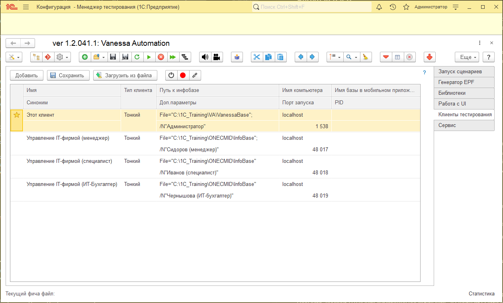
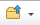
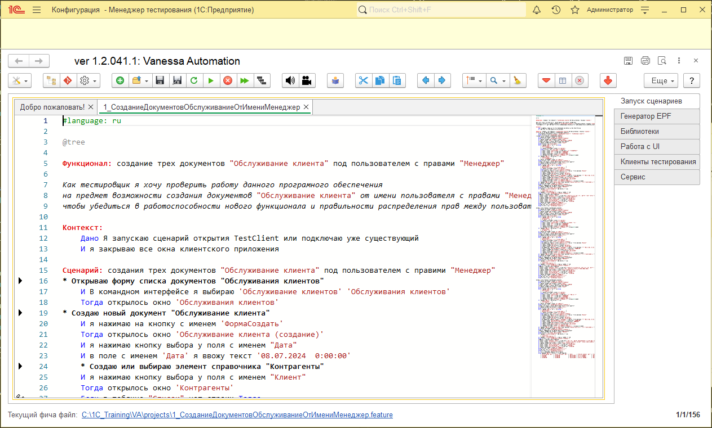
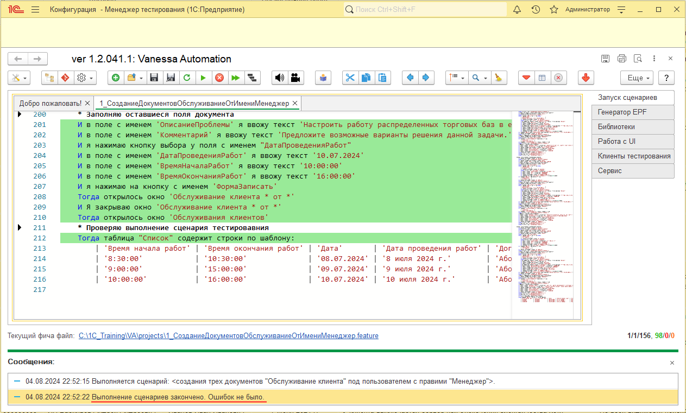

# Инструкция по проведению автоматизированного сценарного тестирования с помощью Vanessa Automation

## Вводная часть
Vanessa Automation – инструмент тестирования прикладных решений на платформе «1С: Предприятие». Представляет набор обработок, состоящая из фреймворков для удобного и гибкого тестирования конфигураций. Реализация написания тестов происходит полностью на языке Gherkin.

Gherkin - это человекочитаемый язык, который используется для описания поведения системы. Данный язык является отличным от языка программирования 1С, но при этом весьма простым и понятным, из-за чего его освоение не занимает много времени.

## Подготовка
1. Первым делом необходимо скачать Vanessa Automation. Это open source программа, поэтому лежит в свободном доступе на github по [этому адресу](https://pr-mex.github.io/vanessa-automation/dev/).
2. Распакуйте и сохраните каталог с обработкой в удобное для вас место.
3. Создайте пустую информационную базу, которая будет использоваться в качестве "менеджера тестирования" для ваших тестируемых конфигураций. Назовите её, например, "Vanessa Automaition".
4. У только что созданной информационной базы пропишите "Дополнительные параметры запуска:" /TESTMANAGER /N Администратор /P "" /Execute "C:\VA\vanessa-automation\vanessa-automation.epf"
   где:
   - /TESTMANAGER - ключ запуска информационной базы в качестве менеджера тестирования;
   - /N "" - имя пользователя запускаемой конфигурации;
   - /P - пароль пользователя указанного в ключе /N;
   - /Execute - путь к файлу, запускаемой обработки.
5. Запускаем нашу настроенную информационную базу и ждем, когда появится интерфейс обработки тестирования Vanessa Automaition.
6. Переходим на вкладку справа: «Клиенты тестирования» и добавляем новых клиентов тестирования, как показано на картинке.
   
   Для наших тестов понадобятся три клиента тестирования, которые по-сути являются одной и той же базой, только запускаются под пользователями с разными правами: менеджер, специалист и бухгалтер ИТ-фирмы.

## Запуск сценариев тестирования
1. На github в папке моего проекта /Content/VAFeatures лежит четыре фича-файла для проведения сценарного тестирования:
   - 1_СозданиеДокументовОбслуживаниеОтИмениМенеджер.feature - запускается под пользователем с правами "Менеджер" и создает три документа "Обслуживание клиента";
   - 2_ЗакрытиеОбслуживанийОтИмениСпециалист.feature - запускается под пользователем с правами "Специалист" и заполняет табличные части у документов "Обслуживание клиента" созданных менеджером;
   - 3_МассовоеСозданиеАктовОтИмениИТБухгалтер.feature - запускается под пользователем с правами "Бухгалтер ИТ-фирмы" и запускает обработку, которая массово создаёт документы "Реализация товаров и услуг" на основе документов "Обслуживание клиента";
   - 4_ФормированиеОтчётаОтИмениИТБухгалтер.feature - запускается под пользователем с правами "Бухгалтер ИТ-фирмы" и запускает на выполнение отчет: "Анализ выставленных актов".
Скачайте эти файлы и скопируйте в удобное для вас место.
2. Откройте в запущеной обработке Vanessa Automaition вкладку "Запуск сценариев", нажмите в верхней панели на пиктограмму  и откройте первый скачанный файл сценария как показано на картинке.
   
3. Запустите сценарий на выполнение нажав в верхней панели инструментов на пиктограмму .
4. В случае успеха все строчки кода сценария будут подсвечены зеленым цветом и внизу экрана будет сообщение об успешном завершении сценария: "Выполнение сценариев закончено. Ошибок не было".
   
5. Повторите эти действия с оставшимися тремя фича-файлами, чтобы завершить тестирование.
