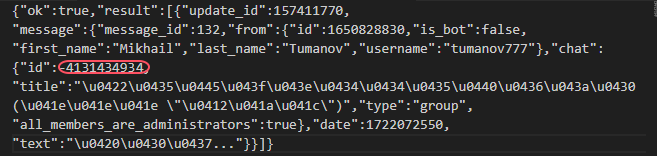
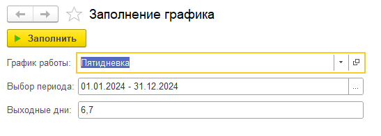
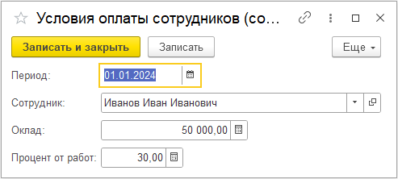

# Инструкция по начальной настройке доработки для конфигурации «Управление IT-фирмой»
---

В данной доработке в конфигурацию добавлены следующие возможности:
- документ для работы с заявками на обслуживание клиентов;
- отправка сообщений специалистам на основании заявки клиента через телеграм-бот;
- хранение вместе с заявками на обслуживание отсканированных актов выполненных работ;
- документы для расчёта управленческой заработной платы (начисление оклада, отпуска, процента от выполненных работ, фиксированной премии и расчёт НДФЛ);
- дополнительные отчеты;
- обработка для массового создания документов Реализация товаров и услуг.

## Установка доработки для конфигурации "Управление IT-фирмой"

Для перехода выполните следующие действия:
1. скопируйте полученный файл конфигурации с доработкой UpdateITFirm.cf в какой-нибудь каталог;
2. откройте вашу информационную базу в режиме "Конфигуратор" монопольно;
3. сделайте архивную копию данных (Администрирование - Выгрузить данные);
4. включите возможность исправления конфигурации поставщика (Конфигурация - Поддержка - Настройка поддежрки...). В появившемся окне нажмите кнопку "Включить возможность изменения" - на появивщийся вопрос ответьте "Да" - в открывшемся окне "Настройка правил поддержки" в обоих вариантах отметьте "Объект поставщика редактируется с сохранением поддержки" и нажмите "Ок", затем "Закрыть";
5. примените изменения нажав клавишу F7 или (Конфигурация - Обновить конфигурацию базы данных);
6. обновите конфигурацию (Конфигурация - Сравнить, объеденить с конфигурацией из файла - Выберите в открывшемся окне файл UpdateITFirm.cf - Нажмите кнопку "Выполнить");
7. примените изменения нажав клавишу F7 или (Конфигурация - Обновить конфигурацию базы данных), затем в появившемся окне "Реорганизация информации" нажмите Применить;
8. запустите конфигурацию в пользовательском режиме, для этого нажмите F5 или (Отладка - Начать отладку);
9. во время запуска в пользовательском режиме произойдет применение установленных обновлений. Дождитесь окончания установки;
10. если в конфигурации "Управление IT-фирмой" были введены пользователи, то после установки обновления для всех пользователей нужно будет заново установить права на доступ к информационной базе.

### Порядок назначения профилей доступа пользователям

Для назначения профилей доступа выполните следующие действия:
- откройте обновленную информационную базу "Управление IT-фирмой" пользователем с административными правами;
- откройте список пользователей (Администрирование - Настройки пользователей и прав - Пользователи);
- для каждого из пользователей откройте настройку его прав доступа ("Права доступа" в панели навигации формы пользователя), установите флажок для выбранного профиля и нажмите "Записать".

11. распределите роли между пользователями в соответствии с их должностными обязанностями. Для разделения прав доступа в разработанном модуле добавлено четыре профиля пользователей:
    - роль Менеджер назначается пользователю ответственному за работу с клиентами и распределение заданий между пользователями с ролью Специалист;
    - роль Специалист назначается пользователю выполняющему заявки по выполнению работ у вашего заказчика;
    - роль Бухгалтер ИТ-фирмы назначается пользователю ответственному за создание документов Реализация товаров и услуг с помощью обработки Массовое создание документов;
    - роль Кадровик-расчётчик назначается пользователю ответственному за начисление заработной платы, премий и распределению отпусков.
12. для отправки сообщений в Телеграм-чат необходим бот, через который будут отправляться ваши сообщения. Если у вас еще нет бота в Телеграм, то создайте его: 
    - Открыть Телеграм в телефоне или на компьютере, найти с помощью поиска бота [BotFather](https://telegram.me/BotFather).
    - Написать ему в сообщении /newbot и выбрать имя, которое будет отображаться в списке контактов.
    - Если имя бота не занято и введено правильно, BotFather пришлет в ответ сообщение с токеном для доступа к созданному боту, который понадобится далее при настройке.
    - Не забудьте задать описание бота и картинку, как описано [здесь](https://tlgrm.ru/docs/bots#edit-settings).
13. для отправки сообщений через Телеграм необходимо создать группу, куда должен быть включен только что созданный бот:
    - Создайте группу в Телеграм;
    - Добавьте в группу только что созданного бота;
    - Назначьте боту права администратора;
14. получите идентификатор группы для чего напишите любое сообщение в группу. Затем с помощью браузера выполните запрос https://api.telegram.org/bot[ВашТокен]/getUpdates. В полученном JSON найдите идентификатор группы, в которой было получено сообщение, и сохраните его. Идентификатор группы будет выглятеть как показано на картинке:

    
15. введите полученный токен Телеграм-бота, идентификатор Телеграм-чата в форме настроек интеграции с Телеграм (Обслуживание клиентов - Настройка интеграции с Телеграм), затем поставьте галочку в чек-боксе Отправлять сообщения в Телеграм-чат и нажмите кнопку Записать и закрыть.
    
16. заполните константы Номенклатура абонентская плата, Номенклатура работы специалиста и НДФЛ. Значения констант Номенклатура абонентская плата и Номенклатура работы специалиста будут отображаться в табличной части Услуги документа Реализации товаров и услуг в колонке Номенклатура. Например, можно задать следующие наименования: "Ежемесячная абонентская плата", "Услуги специалистов".
17. для использования документов для расчета управленческой заработной платы необходимо заполнить графики работы организации на текущий год с помощью обработки Заполнение графика(Обслуживание клиентов - подменю Сервис). Это должно быть минимум два графика: один рабочий и один для расчета отпусков, например "Пятидневка" и "Календарь". Пример заполнения графика приведен на рисунке:
    
18. для правильного функционирования документов Обслуживание клиента и для расчёта управленческой заработной платы должны быть заполнены Условия оплаты сотрудников (Обслуживание клиентов - подменю См. также) для каждого сотрудника организации. Смотрите пример на картинке:
    
